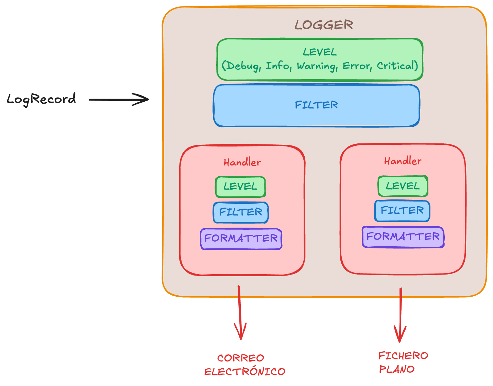

# Introducción al Logging en Python

## ¿Qué es eso de logging?
Si acudimos a la documentación oficial de Python (Python Software Foundation, s. f.), veremos que nos dice que es un módulo en el que se definen funciones y clases que implementan un sistema flexible de registro de eventos. Simplemente es eso, cuando hablamos de establecer un sistema de logging, nos referimos a construir un servicio en el que recojamos los eventos que van surgiendo en tiempo de ejecución de nuestro programa. Acaso, ¿para saber que está pasando en medio de una ejecución, no solemos llenar el código con multitud `print()`? Por ejemplo:

```python
def suma(a,b):
  return a+b

print('Inicio de ejecución')

suma(1,2)

print('Final de ejecución')
```

## ¿Por qué no usar print()?

Recordemos que todo programa posee tres vías principales por las que comunicarse:

- `stdin:` La entrada estándar, que es el lugar donde el programa recibe la información.
- `stdout:` La salida estándar, que es el lugar donde el programa devuelve la información.
- `stderr:` El error estándar, que es el lugar donde el programa devuelve la información en caso de error.

Teniendo en cuenta esto, si posees nociones básicas de Python (espero que sí), te darás cuenta que `print()` es una función que devuelve información por la vía `stdout`. Cosa que está muy bien si quieres hacer pruebas rápidas y simples, pero por un momento, imaginemos que estamos en un proyecto complejo, seguro que: no todos los `print()` son igual de importantes y te gustaría particionarlos por niveles; te gustaría que se mostraran distintos, dependiendo de si estamos desarrollando o el programa está en producción; te gustaría poder recopilarlos en un archivo y no mirarlos en consola; te gustaría que si el programa llega a cierto punto, te escriba un correo electrónico informando de cierto evento, etc. En definitiva, seguro que te gustaría tener un sistema de registro de eventos más versátil, pues eso es lo que nos viene a ofrecer el módulo `logging` de Python.

## Elementos de un sistema de logging en Python
Un diagrama visual de lo que se expone en esta sección.




### Componentes principales

En Python, todo sistema de registro de eventos posee cinco componentes principales. Para ilustrarlos, vamos a suponer que estamos trabajando en un periódico regional.

- **Primer componente: LogRecord.** Es un objeto que almacena toda la información relativa a un evento. En nuestro ejemplo, sería la noticia que un reportero querría que se publicara, componiéndose de: contenido, fecha, hora, lugar, etc.

- **Segundo componente: Logger.** Es el registrador, quien se encarga de recibir los eventos, filtrarlos según su importancia y enviarlos donde corresponda. En nuestro ejemplo, podríamos decir que es el director del periódico, quien recibe las noticias y decide si una noticia está al «nivel» del periódico.
- **Tercer componente: Filter.** Es el censor, quien decide si un evento debe ser registrado o no. Es decir, realiza un filtro más fino que el «nivel». En nuestro ejemplo, sería una especie de censor, quien por ejemplo, si una noticia aporta datos personales, se encargaría de decidir si se publica o no.
- **Cuarto componente: Formatter.** Es el maquetador, quien es el encargado de darle un determinado formato a un evento recibido. En nuestro ejemplo, podríamos decidir que es quien que se encarga de maquetar el estilo de las noticias en un periódico, dándoles un estilo determinado.
- **Quinto componente: Handler.** Es el distribuidor, quien decide donde mandar un evento ya maquetado. En nuestro ejemplo, podríamos decidir que es quien decide si una noticia va en la sección de deportes o en la de sucesos.

### Niveles

Hemos hablado de «niveles» y es que Python, clasifica los niveles de severidad de un evento con una puntuación numérica que van del 10 al 50. En orden ascendente, tenemos:

| Nivel | Severidad |
| --- | --- |
| DEBUG | 10 |
| INFO | 20 | 
| WARNING | 30 | 
| ERROR | 40 | 
| CRITICAL | 50 |

Atendiendo a los nombres, más o menos queda especificado cuando usar cada uno. En caso contrario, en la bibliografía tienes la documentación oficial a la que acudir. Leyéndome me doy cuenta que  me he convertido en uno de esos autores que dejan los detalles técnicos a la imaginación del lector o que omiten florituras aludiendo que son triviales.

### Ejemplo canónico de logging

Si tú buscas logging en Python por internet, seguramente te encontrarás con un ejemplo cuyo script se reduce principalmente a lo siguiente:

```python
import logging

# 1) Creas tu objeto logger
logger = logging.getLogger(__name__)

# 2) Configuras su nivel
logging.basicConfig(level=logging.INFO)

# 3) Creamos distintos logs 
logger.info("Iniciando sesión...")
logger.warning("Contraseña incorrecta")
```

Y es que no tiene más dificultad, pues comprende un ejemplo básico de un sistema de registro de eventos. Sin embargo, está muy lejos de un buen uso del mismo.
### Diagrama de árboles

Cualquier sistema de registro de eventos, puede seguir una estructura en árbol, donde comienza en un logger raíz y se va extendiendo en ramas por cada uno de los subsistemas que lo componen. Por ejemplo:

``` text
                                  ┌───────────────────┐
                                  │    Root Logger    │
                                  ├───────────────────┤
                                  │  • Level          │
                                  │  • Filter         │
                                  │  • Handler        │
                                  └─────────┬─────────┘
                                            │
                     ┌──────────────────────┴──────────────────────┐
                     ▼                                             ▼
          ┌───────────────────┐                         ┌───────────────────┐
          │   Logger "api"    │                         │ Logger "base_datos│
          ├───────────────────┤                         ├───────────────────┤
          │  • Level          │                         │  • Level          │
          │  • Filter         │                         │  • Filter         │
          │  • Handler        │                         │  • Handler        │
          └─────────┬─────────┘                         └───────────────────┘
                    │
                    ▼
          ┌───────────────────┐
          │ Logger "api.auth" │
          ├───────────────────┤
          │  • Level          │
          │  • Filter         │
          │  • Handler        │
          └───────────────────┘
```

Nótese que se van asignando mediante un `.` la relación padre-hijo. Por ejemplo, `api.auth` es un hijo de `api` y `api` es hijo del `root`. Cualquier LogRecord que entre a un nodo hijo, se propaga automáticamente a su padre, abuelo, etc. Por ello, la mejor práctica  consiste en que el *Filter* y el *Handler* solo estén definidos en el nodo raíz y que cada logger hijo, se encargue de establecer su nivel solo. En este ejemplo, el diagrama de árbol quedaría establecido tal que así:

``` text
                                  ┌───────────────────┐
                                  │    Root Logger    │
                                  ├───────────────────┤
                                  │  • Level          │
                                  │  • Filter         │
                                  │  • Handler        │
                                  └─────────┬─────────┘
                                            │
                     ┌──────────────────────┴──────────────────────┐
                     ▼                                             ▼
          ┌───────────────────┐                         ┌───────────────────┐
          │   Logger "api"    │                         │ Logger "base_datos│
          ├───────────────────┤                         ├───────────────────┤
          │  • Level          │                         │  • Level          │
          └─────────┬─────────┘                         └───────────────────┘
                    │
                    ▼
          ┌───────────────────┐
          │ Logger "api.auth" │
          ├───────────────────┤
          │  • Level          │
          └───────────────────┘
```

¿Por qué esto es de vital importancia? Porque definiendo un logger a nivel de módulo usando `logger = logging.getLogger(__name__)` y por tanto, la estructura de tu sistema de registro de eventos, coincide con la de la librería que estás creando. No obstante, esto no se suele recomendar por lo que se expone a continuación.

## ¿Cuántos loggers necesito realmente?
Muchos tutoriales sugieren hacer `logger = logging.getLogger(__name__)` por cada archivo `.py`. Sin embargo, esto crea un árbol con muchas ramificaciones y puede ser complicado de gestionar. Según mi experiencia, una mejor aproximación consiste en:

- **Para proyectos pequeños o medianos**: Un único logger hijo colgando del `root`.
- **Para proyectos grandes**: Un logger por cada subsistema colgando directamente del `root`, evitando profundizar en la jerarquía.


## Configuración de tu sistema de registro de eventos
 Como habitantes del siglo XXI (espero), nos hemos atiborrado de ver archivos de configuración planteados en un JSON, YAML o incluso, TOML. Por ello, no vamos a ir a contracorriente y procederemos a configurar nuestro sistema de registro de eventos con un JSON (el caso YAML/TOML es completamente análogo -una vez más me he convertido en lo que detestaba-).

 ### Esqueleto básico

 Se presenta la estructura que debes plasmar en tu archivo `config.json`:

  ```json
  {
   "version": 1,
   "disable_existing_loggers": false,
   "filters": {},
   "formatters": {},
   "handlers": {},
   "loggers": {}
  }
  ```

 - **`version`**: Por ahora su único valor válido es `1`.
 - **`disable_existing_loggers`**: Si se establece en `false`, conservará activos los loggers ya existentes (muy recomendado en proyectos modernos para no silenciar logs de librerías de terceros).
 - **`filters`**: En esta sección se definen los filtros.
 - **`formatters`**: En esta sección se definen los formatos.
 - **`handlers`**: En esta sección se definen los manejadores.
 - **`loggers`**: En esta sección se definen los loggers.


### ¿Cómo usamos este archivo de configuración?

Para un mejor entendimiento, realizaremos un sistema de registro de eventos que informe por `stdout`. 

Nuestro archivo `config.json` (por llamarlo de alguna manera, porque en rigor, podría tener la extensión que quisiéramos) quedaría de la siguiente manera:

   ```json
  {
   "version": 1,
   "disable_existing_loggers": false,
   "formatters": {
       "simple": {
           "format": "%(asctime)s - %(name)s - %(levelname)s - %(message)s"
       }
   }, 
   "handlers": {
     "stdout": {
       "class": "logging.StreamHandler",
       "formatter": "simple",
       "stream": "ext://sys.stdout"
     }
   }, 
   "loggers": {
     "my_app": {
       "level": "DEBUG"
     }
   },
   "root": {
       "level": "WARNING", 
       "handlers": ["stdout"]
   }
  }
  ```

 Nótese que hemos asignado un formato  definido como "simple" y le hemos puesto algunos atributos de `LogRecord` que pueden consultarse en (Python Software Foundation, s. f.).

 De esta forma ya podemos crear el logger y hacer uso de él. Un ejemplo de `main.py` sería el siguiente:

 ``` python
import json
import logging
import logging.config

with open("config.json", "r", encoding="utf-8") as f:
  config = json.load(f)
  
logging.config.dictConfig(config)
logger = logging.getLogger("my_app")

logger.debug("Este es un mensaje de depuración")
logger.info("Este es un mensaje informativo")
logger.warning("Este es un mensaje de advertencia")
logger.error("Este es un mensaje de error")
logger.critical("Este es un mensaje crítico")
```

### Personalización
Cuando configuras tu sistema de registro de eventos, se pueden personalizar los `formatters`, `handlers` y `filters`.

#### Formatters
Imagina que quieres que tus logs tengan formato JSON, que es el estándar de facto para estructurar la información en la industria. Para ello, bastaría con agregar lo siguiente en `config.json`, al mismo nivel que la clave "simple".

```json
"json": {
  "()": "mylogger.MyJSONFormatter",
  "fmt_keys": {
    "level": "levelname",
    "timestamp": "timestamp",
    "module": "module",
    "line": "lineno",
    "message": "message"
  }
}
```
En este caso, la clave `()` indica que se debe instanciar la clase `MyJSONFormatter` y sus atributos se pasarían como parámetros. Para ello, crearíamos la siguiente clase en un archivo `mylogger.py`.

```python
import datetime as dt
import json
import logging

class MyJSONFormatter(logging.Formatter):
    """Formateador de logs personalizable para emitir eventos estructurados en JSON/JSONL."""

    def __init__(self, *, fmt_keys: dict[str, str] | None = None):
        """Inicializa el formateador con el mapeo de campos deseado.

        Args:
            fmt_keys: Diccionario con la estructura {"clave_salida_json": "atributo_logrecord"}.
                      Ejemplo: {"level": "levelname", "timestamp": "timestamp"}.
        """
        super().__init__()
        # Si no se provee un mapeo, inicializa un diccionario vacío para evitar iterar sobre None
        self.fmt_keys = fmt_keys if fmt_keys is not None else {}

    def _prepare_log_dict(self, record: logging.LogRecord) -> dict:
        """Extrae y procesa los atributos del LogRecord para generar el diccionario final.

        Resuelve atributos nativos del registro, así como campos calculados
        dinámicamente en tiempo de ejecución (como el timestamp ISO 8601 en UTC, ¡acuérdate siempre en UTC!).
        """
        # Campos dinámicos o que requieren procesamiento previo antes de ser serializados
        computed_fields = {
            "message": record.getMessage(),
            "timestamp": dt.datetime.fromtimestamp(
                record.created, tz=dt.timezone.utc
            ).isoformat(),
        }

        log_dict = {}

        # Construye el objeto respetando exclusivamente el orden y los nombres de fmt_keys
        for json_key, record_attr in self.fmt_keys.items():
            if record_attr in computed_fields:
                # Asigna el valor dinámico previamente calculado
                log_dict[json_key] = computed_fields[record_attr]
            else:
                # Extrae el atributo nativo de LogRecord (ej. 'levelname', 'module', 'lineno')
                # Retorna None si el atributo solicitado no existe en el registro
                log_dict[json_key] = getattr(record, record_attr, None)

        return log_dict

    def format(self, record: logging.LogRecord) -> str:
        """Convierte el LogRecord en una cadena de texto en formato JSON de una sola línea (JSONL)."""
        message = self._prepare_log_dict(record)
        # default=str asegura que objetos no serializables nativamente (p. ej. excepciones o datetimes)
        # se conviertan a cadena sin romper el formateador
        return json.dumps(message, default=str)
```

Estructuralmente, todo quedaría de la siguiente forma:
```plaintext
mi_proyecto/
│
├── config.json
├── main.py
└── mylogger.py
```
#### Filters
Nuevamente, imagina que estás en el punto que no quieres que se registre cierta información sensible como contraseñas o claves de API. Pues para ello, bastaría con agregar lo siguiente en `config.json` dentro de filters.

```python
"sensitive_data_filter": {
  "()": "mylogger.SensitiveDataFilter",
  "keywords": ["password", "bearer", "api_key", "secret"]
}
```
Ahora, definimos la clase en `mylogger.py`.

```python
import logging

class SensitiveDataFilter(logging.Filter):
    """Filtra y descarta registros que contengan palabras sensibles especificados en 'keywords'."""

    def __init__(self, keywords: list[str] | None = None):
        super().__init__()
        self.keywords = keywords if keywords is not None else ["password", "token", "secret"]

    def filter(self, record: logging.LogRecord) -> bool:
        # Obtenemos el texto completo del mensaje
        message = record.getMessage().lower()

        # Si alguna palabra clave está en el mensaje, devolvemos False (bloquear)
        for keyword in self.keywords:
            if keyword.lower() in message:
                return False

        return True  # Permitir el paso del log
```

Con lo que nuestro `config.json` quedaría algo así (vinculando el filtro dentro del handler):

```json
{
  "version": 1,
  "filters": {
    "sensitive_data_filter": {
      "()": "mylogger.SensitiveDataFilter",
      "keywords": ["password", "bearer", "api_key", "secret"]
    }
  },
  "handlers": {
    "stdout": {
      "class": "logging.StreamHandler",
      "formatter": "json",
      "stream": "ext://sys.stdout",
      "filters": ["sensitive_data_filter"]
    }
  }
}
```

#### Handlers
Por último, imagina que además de registrar los eventos en un archivo, también quieres que se envíen notificaciones a un canal de Slack cuando ocurra algún error. Para ello, bastaría con agregar lo siguiente en `config.json` dentro de handlers:

```json
"slack_handler": {
  "()": "mylogger.SlackHandler",
  "level": "ERROR",
  "formatter": "simple",
  "webhook_url": "https://hooks.slack.com/services/TU_WEBHOOK_DE_SLACK"
}
```
Ahora, definimos la clase en `mylogger.py`.

```python
# mylogger.py
import json
import logging
import urllib.request


class SlackHandler(logging.Handler):
    """Handler personalizado para enviar alertas de log a un Webhook de Slack."""

    def __init__(self, webhook_url: str, level=logging.ERROR):
        super().__init__(level=level)
        self.webhook_url = webhook_url

    def emit(self, record: logging.LogRecord):
        try:
            # Formateamos el mensaje de log
            log_entry = self.format(record)

            # Preparamos el payload en el formato que espera Slack
            payload = {
                "text": f"🚨 *{record.levelname}* en `{record.name}`\n```{log_entry}```"
            }
            data = json.dumps(payload).encode("utf-8")

            # Enviamos la petición HTTP POST
            req = urllib.request.Request(
                self.webhook_url,
                data=data,
                headers={"Content-Type": "application/json"},
            )
            with urllib.request.urlopen(req, timeout=5) as response:
                pass
        except Exception:
            # Evita que un fallo al enviar a Slack rompa la aplicación principal
            self.handleError(record)
```

Con lo que nuestro `config.json` quedaría algo así:
``` json
{
  "version": 1,
  "disable_existing_loggers": false,
  "formatters": {
    "simple": {
      "format": "%(asctime)s - %(name)s - %(levelname)s - %(message)s"
    },
    "json": {
      "()": "mylogger.MyJSONFormatter",
      "fmt_keys": {
        "level": "levelname",
        "timestamp": "timestamp",
        "module": "module",
        "line": "lineno",
        "message": "message"
      }
    }
  },
  "filters": {
    "sensitive_data_filter": {
      "()": "mylogger.SensitiveDataFilter",
      "keywords": ["password", "bearer", "api_key", "secret"]
    }
  },
  "handlers": {
    "stdout": {
      "class": "logging.StreamHandler",
      "stream": "ext://sys.stdout",
      "formatter": "json",
      "filters": ["sensitive_data_filter"]
    },
    "slack_handler": {
      "()": "mylogger.SlackHandler",
      "level": "ERROR",
      "formatter": "simple",
      "webhook_url": "https://hooks.slack.com/services/TU_WEBHOOK_DE_SLACK"
    }
  },
  "loggers": {
    "my_app": {
      "level": "DEBUG"
    }
  },
  "root": {
    "level": "WARNING",
    "handlers": ["stdout", "slack_handler"]
  }
}
```

#### Aclaración
Si en `main.py` instanciaras un logger con cualquier otro nombre que no esté en el JSON, Python lo creará dinámicamente. Al no estar definido explícitamente, heredará el nivel de severidad del root (en este caso, WARNING). Sin embargo, gracias a la propagación automática, cualquier mensaje que emita viajará hacia el nodo raíz. Esto significa que sí se formateará en JSON y sí aplicará nuestros filtros de seguridad, garantizando que incluso los logs de librerías de terceros mantengan una estructura homogénea en toda nuestra aplicación.

## Conclusión
Bueno, creo que ya en este punto posees suficiente materia gris para hacer auténticas virguerías con este módulo. Cualquier cosa que imagines, serás capaz de plasmarla.

## Bibliografía
- mCoding. (23 de enero de 2024). Modern Python logging [Archivo de Video]. YouTube. http://www.youtube.com/watch?v=9L77QExPmI0
- Python Software Foundation. (s. f.). *logging* — *Logging facility for Python*. Python 3 documentation. Recuperado el 26 de julio de 2026, de https://docs.python.org/3/library/logging.html
